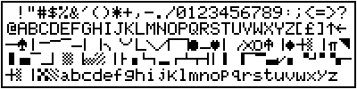

# cbmtext 0.1
Print a Unicode UTF-8 encoded textfile from a modern PC with an old-fashioned **Commodore MPS 803** compatible printer.
## Purpose
This utility outputs raw bytes for printing Unicode texts (UTF-8 encoded) on a [Commodore MPS 803](http://www.zimmers.net/cbmpics/p6serial3.html) compatible printer. It should be used with [**opencbm**](http://spiro.trikaliotis.net/opencbm) package by [Spiro Trikaliotis](http://spiro.trikaliotis.net/) to redirect the output to the printer, connected through a [XUM1541 cable](https://rdist.root.org/2009/01/21/introducing-xum1541-the-fast-c64-floppy-usb-adapter/), such as [ZoomFloppy](http://www.go4retro.com/products/zoomfloppy/).

Commodore MPS 803 has natively a non-standard ASCII variant called PETSCII, missing a lot of symbols like letters with accents, and including a few of non-standard graphic symbols:

With **cbmtext** the MPS 803 will be able to print modern text-files including those with international characters, like letters with diacritics and cyrillic alphabet.
## Contents of package
- **source/** - Source code in C
  - [**cbmtext.cpp**](https://github.com/sblendorio/cbmtext/blob/master/source/cbmtext.cpp) - Main program
  - [**chardefs.h**](https://github.com/sblendorio/cbmtext/blob/master/source/chardefs.h) - Dot-matrix character definitions
  - [**utf8.h**](https://github.com/sblendorio/cbmtext/blob/master/source/utf8.h) - [**UTF8-CPP** library](http://utfcpp.sourceforge.net/), entry point
  - **utf8/** - [**UTF8-CPP** library](http://utfcpp.sourceforge.net/)
    - [**core.h**](https://github.com/sblendorio/cbmtext/blob/master/source/utf8/core.h) - part of the library
    - [**checked.h**](https://github.com/sblendorio/cbmtext/blob/master/source/utf8/checked.h) - part of the library
    - [**unchecked.h**](https://github.com/sblendorio/cbmtext/blob/master/source/utf8/unchecked.h) - part of the library
  - [**Makefile**](https://github.com/sblendorio/cbmtext/blob/master/source/Makefile)
- **binaries/** - Precompiled executable files for different platforms
  - **windows**/[**cbmtext.exe**](https://github.com/sblendorio/cbmtext/blob/master/binaries/windows/cbmtext.exe?raw=true) - for **Windows**
  - **macOS**/[**cbmtext**](https://github.com/sblendorio/cbmtext/blob/master/binaries/macOS/cbmtext?raw=true) - for **macOS**, 64 bit
  - **linux**/[**cbmtext**](https://github.com/sblendorio/cbmtext/blob/master/binaries/linux/cbmtext?raw=true) - for **Linux** (x86_64)
- [**sample.txt**](https://github.com/sblendorio/cbmtext/blob/master/sample.txt) - Sample Unicode text file, UTF-8 encoded

## Requirements
- **macOS** or **Windows** (32/64 bit) or **Linux**
- an **MPS 803** printer or a **compatible one**
- [**XUM1541**](https://rdist.root.org/2009/01/21/introducing-xum1541-the-fast-c64-floppy-usb-adapter/) / [**ZoomFloppy**](http://www.go4retro.com/products/zoomfloppy/)
- [**opencbm**](http://spiro.trikaliotis.net/opencbm) package installed (a.k.a. **cbm4win**)
- **g++** if you want to compile from sources

## Install ***opencbm***
To install [**opencbm**](http://spiro.trikaliotis.net/opencbm) you can use the installer from its website, or if you use a debian-based version of Linux, you can install it with:

`sudo apt-get install opencbm`

on macOS you can use a similar command (with the help of [Homebrew Package Manager](https://brew.sh/)):

`brew install opencbm`

## Compiling ***cbmtext***
Once you have **g++** installed, just enter the **"source"** directory and launch:

`make`

An executable file named **"cbmtext"** will be generated: it's ready to use.

## Using ***cbmtext***

Synopsis:
```
cbmage <text file name>
cbmage -
```
This is the basic syntax: it will read the text file (first case), or from standard input (second case, giving "-" as parameter) writing on *standard output* (so, the terminal window) the raw bytes that should be interpreted by the **MPS 803** printer.

The input stream (file on disk or standard input) **must** be **UTF-8** encoded. The output must be redirected to the printer: let's see how.

## Let's use it with ***opencbm***
The typical sequence of command you should use to do the task is:

    cbmctrl reset
    cbmctrl lock
    cbmctrl listen 4 0
    ./cbmtext sample.txt | cbmctrl write
    cbmctrl unlisten
    cbmctrl unlock

In particular, the **4th line** (`./cbmtext sample.txt | cbmctrl write`) produces the raw bytes (launch it **without "./"** if you run it **on Windows**), which are redirected to the printer through the piped `cbmctrl write` command.

## Restrictions
Commodore MPS 803 is an **80 columns** printer, so the text lines will be broken at the 80th character. Currently there is no *word wrap* function in *cbmtext*, so you have to word-wrap the text before sending it to the printer, i.e. with the **fold** Unix command:

    $ cat sample.txt | fold -w 80 | ./cbmtext - | cbmctrl write
    
## Details: character definitions
To print an international text on a CBM MPS 803, we have to mix text mode (for pre-defined *PETSCII* characters in printer's ROM) and graphics mode (for **all** the other symbols). Those *new* symbols have been implemented as dot-matrix definitions in the header file [**chardefs.h**](https://github.com/sblendorio/cbmtext/blob/master/source/chardefs.h), in that way:
```
{L'á', {
  0b001100,     // ..██..
  0b000000,     // ......
  0b011000,     // .██...
  0b000100,     // ...█..
  0b011100,     // .███..
  0b100100,     // █..█..
  0b011010 }},  // .██.█.
```
Literal binary constants are exactly the 6x7 human-readable bitmap representing the character (1 is for black, 0 for white). If for a particular glyph, a pre-defined character could be used, the syntax is the following:
```
{L'ρ', {'P'}},
```
It's the case of **rho** lowercase greek letter. It's similar to a latin lowercase **p**, so it can be inserted as a *single-character* replacement. But we replaced it apparently with an **uppercase** "P": that's because *PETSCII* charset, used by MPS 803, has *swapped* lowercase and uppercase letters.

So, by editing the header file [**chardefs.h**](https://github.com/sblendorio/cbmtext/blob/master/source/chardefs.h) you can add or modify the definitions the dot matrix related to each Unicode character. If a character is not yet coded, it will be printed as *missing glyph* symbol "□", also defined in the same file:
```
static list<char> missing_glyph = {
  0b111110,     // █████.
  0b100010,     // █...█.
  0b100010,     // █...█.
  0b100010,     // █...█.
  0b100010,     // █...█.
  0b100010,     // █...█.
  0b111110      // █████.
};
```
## Credits
Thanks to [**Spiro Trikaliotis**](http://spiro.trikaliotis.net/) for the [opencbm package](http://spiro.trikaliotis.net/opencbm), to [**Till Harbaum**](http://spiro.trikaliotis.net/xu1541) for the initial case study of the [XU1541](http://spiro.trikaliotis.net/xu1541) (and also for the fantastic [MIST](http://harbaum.org/till/mist/index.shtml)) and to **ntrifunovic** for the useful [UTF8-CPP library](http://utfcpp.sourceforge.net/) library.

## Sample printed text file


